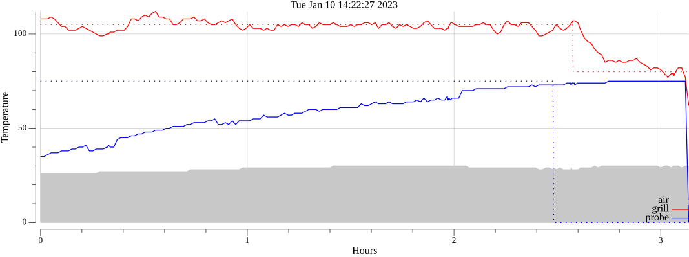

# WiFire

Temperature monitoring for Traeger grills. For use as a library or standalone
command.

## building

From the root of the project type `make` to bootstrap the build environment,
this will create a `.builder` directory with a bunch of makefiles. Type `make`
again for help. Use the `build` target to build the `wifire` cli.

## cli

The `wifire` command requires both `--username` and `--password` flags, use the
same credentials used for the Traeger mobile app. With no other options the
command will start logging to the terminal received temperature updates from
your grill. For example:

```
2:21PM INF ambient=28 grill=80 grill_set=80 probe=15 probe_alarm=false probe_set=70
2:22PM INF ambient=27 grill=80 grill_set=80 probe=17 probe_alarm=false probe_set=70
2:23PM INF ambient=27 grill=80 grill_set=80 probe=17 probe_alarm=false probe_set=70
```

Use the `--output` flag to also log JSON to a file.

Run `wifire` with no arguments to see the help and usage.

### plot


After a session of logging with the `--output` flag run `wifire plot` and use
the `--input` flag to specify a JSON log file. The result is a file called
`wifire.png` the will look the following:




